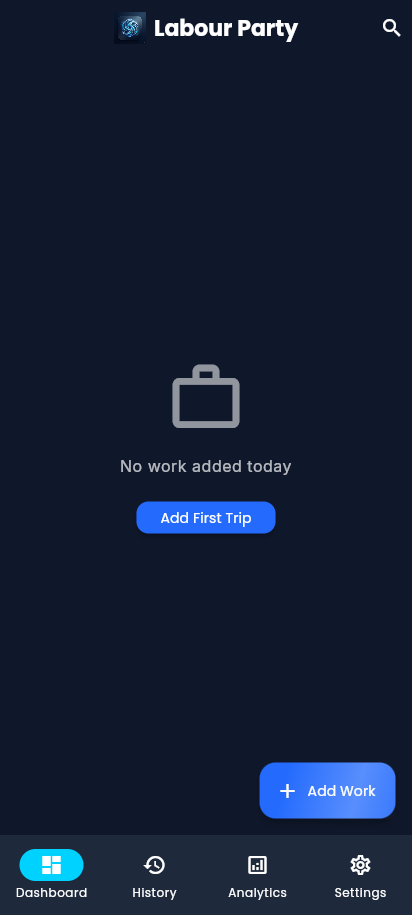
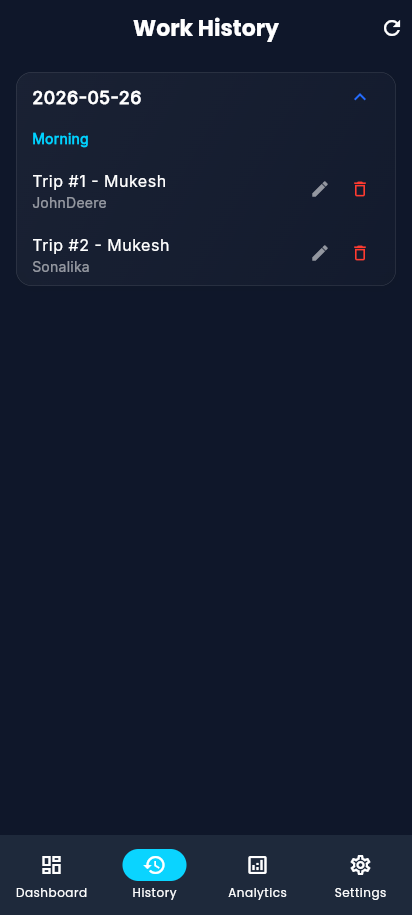
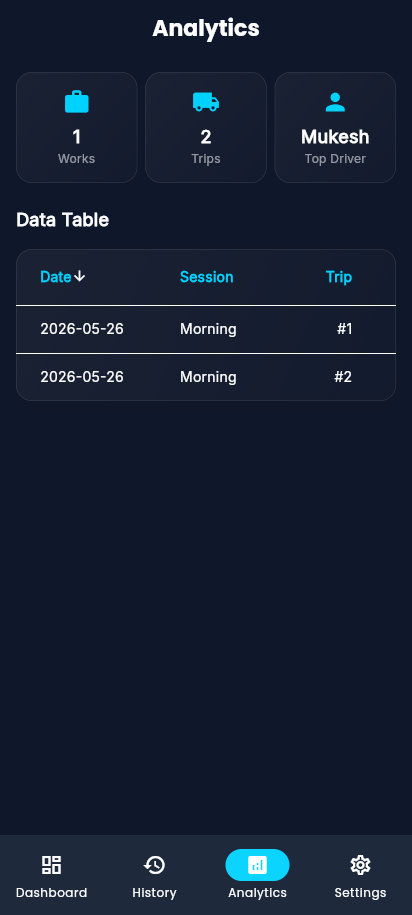

# ⚠️ LEGACY REFERENCE README — NOT the SAND WORKS implementation specification

> **DO NOT treat this file or the Flutter code it describes as the product to build.**
>
> This `README.md` documents the **legacy single-user Flutter "Labour Party" app**, which the SAND WORKS rebuild treats as a **behavioural reference only** (`lib/`). It is **not** the SAND WORKS specification and its content below (e.g. "operates entirely locally without remote APIs", single-user, Hive, `.labourbackup`) does **not** apply to the target build.
>
> **Authoritative specification — read these instead:**
> - Frozen SAND WORKS spec: `docs/10-SANDWORKS/` (start `docs/10-SANDWORKS/README.md`). Roles OWNER/DRIVER/LABOURER; money engine, daily closure, leaderboards, temp-labour expiry, notifications, export, offline+Firebase sync, package `com.roshan.sandworks`, brand **SAND WORKS**, START FRESH.
> - Execution control plane: `docs/09-IMPLEMENTATION/` (52 SW tasks, 9 phases) → `docs/09-IMPLEMENTATION/README.md`.
> - Binding rules: `docs/03-ENGINEERING/AGENT.md` §14.
> - Legacy reference material (kept, not authoritative): `docs/`, `docs/08-NATIVE-ANDROID/` (architectural continuity only, non-conflicting).
>
> **Sections 1–12 below are preserved legacy reference content about the Flutter app. They are intentionally NOT updated to SAND WORKS and must not be cited as SAND WORKS requirements.**

---

# LEGACY — "Labour Party" Flutter Reference App README

# 1. Project Overview
- **Name:** Labour Party (legacy Flutter reference app)
- **Type:** Offline-first Android application
- **Purpose:** Labour trip management and tracking.
- **Scope Boundaries:** Operates entirely locally without remote APIs, cloud backend, or internet dependencies.

# 2. Key Capabilities
- **Work management:** Organize and group specific jobs.
- **Trip tracking:** Record individual trips, drivers, and tractors.
- **Labour tracking:** Associate labour participation explicitly per trip.
- **History:** Browse structured historical records chronologically.
- **Analytics:** View computed performance and operational metrics.
- **Backup/Restore:** Export and import local datasets.
- **Draft autosave:** Capture form changes real-time preventing data loss during edits.
- **Offline operation:** 100% offline local-only operation out of the box.

# 3. Architecture
- **Clean Architecture:** Strict separation between Presentation, Domain, and Data layers.
- **BLoC:** Manages state transitions explicitly.
- **Hive:** Handles NoSQL rapid document storage.
- **Repository Pattern:** Abstracts local database interactions from business rules.
- **Local-only persistence:** Data lives uniquely on the device within Android Sandboxing.

# 4. Application Flow
- Dashboard
- Add/Edit (Work forms)
- Confirm Next Trip (Sequential trip continuation)
- Trip Details (In-depth metadata)
- History (Archive viewing)
- Analytics (KPI computations)
- Settings (Backup mechanics)

# 5. Data Model Overview
- **Work:** Top-level identifier grouping trips.
- **Trip:** Core execution event (Time, Notes, Driver, Tractor).
- **Labour:** Persistent global entities available for selection.
- **TripLabour:** Relationship mapping a specific Labour entity to a Trip.
- **Draft:** Transient storage for autosaved active edits.

# 6. Backup & Restore
- **Format:** Operates via exported `.labourbackup` files.
- **SAF Flow:** Leverages Android Storage Access Framework (Scoped Storage) to avoid broad file permissions.
- **Restore limits:** Constrained to < 25MB to prevent memory isolates from overflowing during restore parsing.
- **Migration expectations:** Users migrating between mismatched APK signatures must export `.labourbackup`, reinstall, and restore.

# 7. Release Status
- Release Candidate Approved
- Production Certification Deferred

# 8. Production Readiness Summary
The repository has undergone a strict, multi-phase audit evaluating the frontend logic bounds, database integrity constraints, and offline security scope. Please reference the [Production Readiness Report](docs/production_readiness/PRODUCTION_READINESS_REPORT.md) for detailed deliverables.

# 9. Development
- **Setup:** `flutter pub get`
- **Analyze:** `flutter analyze`
- **Test:** `flutter test`
- **Build:** `flutter build apk --release` (Requires `android/key.properties` configuration)

# 10. Maintenance Policy
**Allowed:**
- Bug fixes
- Security patches
- Database migration logic
- QA implementations

# 11. Application Screenshots
A full gallery of application screenshots is available in the [Screenshots Gallery](docs/screenshots/README.md).

| Dashboard | History | Analytics |
| :---: | :---: | :---: |
|  |  |  |

---

## 12. Audit Documentation (forensic audit suite)

A Principal Forensic Audit & native-Android specification suite is provided under `docs/` (added 2026-09-07 on the `audit/documentation` branch, **no application source was modified**).

- Start at [`docs/00-AUDIT-INDEX.md`](docs/00-AUDIT-INDEX.md) — executive audit conclusion.
- Full index: [`docs/DOCUMENTATION-INDEX.md`](docs/DOCUMENTATION-INDEX.md).
- Consolidated report PDF: [`docs/AUDIT-REPORT.pdf`](docs/AUDIT-REPORT.pdf).

**Status note:** This documentation records the existing Flutter reference product. The native Android (Kotlin/Compose/Firebase) rebuild is **specified only — it has not been implemented.** See `docs/08-NATIVE-ANDROID/IMPLEMENTATION-ROADMAP.md`.

**SAND WORKS supersession (2026-09-07):** the rebuild is governed by the locked **SAND WORKS** spec — `docs/10-SANDWORKS/` (authoritative, roles OWNER/DRIVER/LABOURER, package `com.roshan.sandworks`) executed via `docs/09-IMPLEMENTATION/` (52 SW tasks). This Flutter app and `docs/08-NATIVE-ANDROID/` are **reference/continuity material only**; where they conflict with `10-SANDWORKS`, `10-SANDWORKS` wins. Do not treat this legacy README as a SAND WORKS requirement source.
