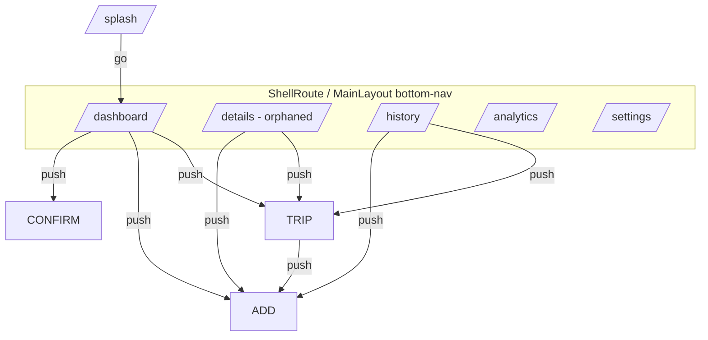

# Navigation Map & Route Register

Purpose: complete navigation graph, route register, and back/drawer/bottom-nav analysis. Status: VERIFIED. Commit `2dd2fe4`.

## 1. Router (VERIFIED)
`go_router` config in `lib/routes/app_router.dart`. Initial route: `/splash`. Root navigator + one `ShellRoute` (nested navigator) hosting the bottom-nav tabs.

### Route register
| Route | Screen | In shell | Navigation | Extra payload |
|---|---|---|---|---|
| `/splash` | S-01 | no | initial | — |
| `/dashboard` | S-02 | yes (tab0) | `go` from splash/nav | — |
| `/details` | S-03 | yes (no tab) | unreachable from nav | — |
| `/settings` | S-06 | yes (tab3) | nav | — |
| `/history` | S-04 | yes (tab1) | nav | — |
| `/analytics` | S-05 | yes (tab2) | nav | — |
| `/trip-details` | S-07 | no | `push` | `Trip` |
| `/add-edit-work` | S-08 | no | `push` | Map (`isNew`,`editingTrip`,`editingWork`,`editingLabours`) |
| `/confirm-next-trip` | S-09 | no | `push` | Map (`work`,`nextTripNumber`,`previousLabours`,`place`,`workType`) |

### Navigation method (VERIFIED)
- Tabs & post-splash use `context.go(...)` (replace, resets back stack to the tab).
- Sub-pages use `context.push(...)` (stack). Returns via `context.pop()`.
- State-carrying navigation uses `state.extra`; **TripDetailsScreen reads `state.extra as Trip`** and casts directly → deep-linking without extra would crash (`UNVERIFIED` robustness). Note: GoRouter by default passes `extra` only for in-session pushes; URL-based navigation of `extra`-bearing routes is fragile.

## 2. Bottom navigation (VERIFIED)
`MainLayout` uses Material 3 `NavigationBar` with 4 destinations: Dashboard(0), History(1), Analytics(2), Settings(3). `selectedIndex` derived from current path; tapping calls `context.go`. No drawer. This matches the 4–5 destination guidance.

## 3. Back arrow / system back behaviour (VERIFIED)
- Pushed screens (Trip Details, Add/Edit, Confirm Next Trip): leading back arrow defaults or is custom; system back pops.
  - S-08 custom back saves the draft before `pop()` (good).
  - S-09 pops immediately after dispatching save (relies on BLoC success handling separately).
- Top-level tabs: no leading back (system back exits app from shell).
- No `PopScope` handling for unsaved changes on S-09 (back discards silently); S-08 has draft autosave instead.
- **Unsaved-changes behaviour:** Add/Edit autosaves draft; Confirm Next Trip has no draft & system back discards. Noted for native `PopScope`.

## 4. Deep links (VERIFIED/MISSING)
No deep-link scheme/App Links declared; no intent-filter routes beyond launcher; `extra`-based navigation isn't deep-link-safe. **Native:** evaluate App Links only if a companion web/product needs them.

## 5. Drawer / hamburger (VERIFIED — none)
No `Drawer`, no hamburger icon anywhere. Navigation is bottom-nav only.

## 6. Recommended native navigation model (PROPOSED)
- Jetpack Navigation Compose with 4–5 top-level destinations via bottom bar (roles may change the set).
- Owner home: Dashboard, Crew/Work, Attendance, Reports, Settings (+ notifications via bell).
- Driver home: My Jobs, Status, Profile.
- Labourer home (if separate): My Attendance.
- Use `SavedStateHandle`/ViewModel to survive process recreation; deep-link safe IDs (never rely on passing whole objects via extras).

## 7. Cross-doc consistency
Routes above match `SCREENS.md` S-IDs. Orphan `/details` flagged.
