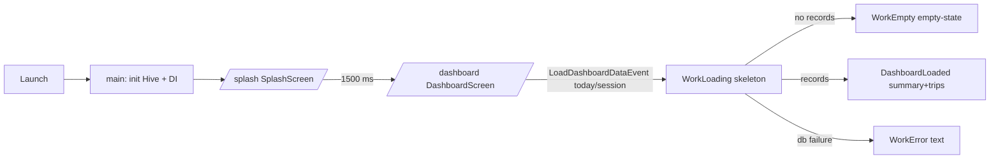
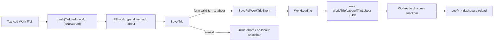
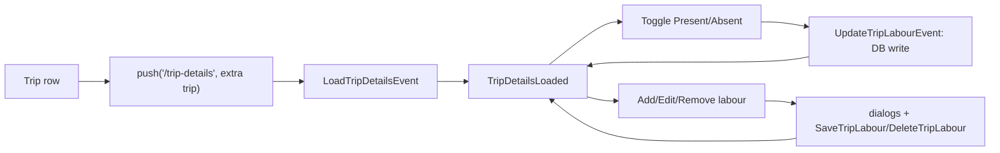
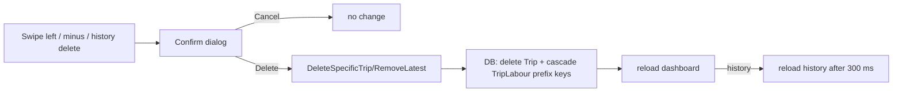
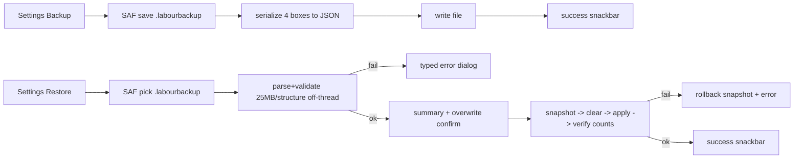

# UX Flows

Purpose: Detailed flow diagrams for the current product. Each flow lists user action → application response → state transition → (local data) → next navigation. Status: VERIFIED (code-traced) unless PROPOSED. Commit `2dd2fe4`.

Legend: `DB` = Hive local; `/route` = go_router.

## 1. First launch / session start

User action: none (auto). State: WorkInitial→Loading→Loaded/Empty/Error.

## 2. Add a new Work+Trip


## 3. Add "Next Trip" (copy last)

```mermaid
flowchart LR
  A[Tap + on Current-Trip] --> B[NavigateToConfirmNextTripEvent]
  B --> C[BLoC finds last trip & labours]
  C --> D[NavigateToConfirmNextTripState]
  D --> E[dashboard listener pushes /confirm-next-trip]
  E --> F[ConfirmNextTripScreen prefilled]
  F --> G[Save as Next Trip]
  G --> H[SaveNextTripEvent: DB write] --> I[pop + reload dashboard]
```


## 4. Attendance on a trip


## 5. Search (current)
User types in dashboard search → each keystroke `SearchDashboardEvent` → sets query → reload dashboard → `LoadDashboardDataEvent` filters trips by driver/tractor/tripNo/workType/place. No results → list shows nothing ("No trips in current session" message area). Clear (X) resets.

## 6. Delete a trip


## 7. Backup & restore


## 8. Draft recovery
User opens Add Trip with an existing draft → snackbar "You have an unsaved draft." → tap Restore → fields & labour list repopulated.

## 9 (PROPOSED) Native: authentication & role resolution
```mermaid
flowchart LR
  A[Launch] --> B[Auth State listener]
  B -->|signed out| C[Login]
  C --> D[Firebase Auth]
  D --> E[Fetch role (custom claims / role doc / CF)]
  E --> F[Route by role: Owner/Driver/Labourer home]
  B -->|signed in| E
```
Authz enforced server-side; client role only drives UI.

## 10 (PROPOSED) Native: owner assigns a job to driver
Create job → CF validates owner → Firestore job doc (ownerId) → notify driver (FCM) → driver updates status via server-validated function.

## 11 (PROPOSED) Native: offline write + reconcile
Driver updates offline → local queue → on reconnect replay via authorized write → conflict policy resolves (no silent overwrite) → audit log.

## Flow coverage gaps (current)
No onboarding, no login/logout, no password recovery, no role selection, no notifications, no session expiry, no permission-denial flow, no network-failure (offline app). These do not exist → documented as MISSING/not-applicable in current product; see `08-NATIVE-ANDROID/`.
