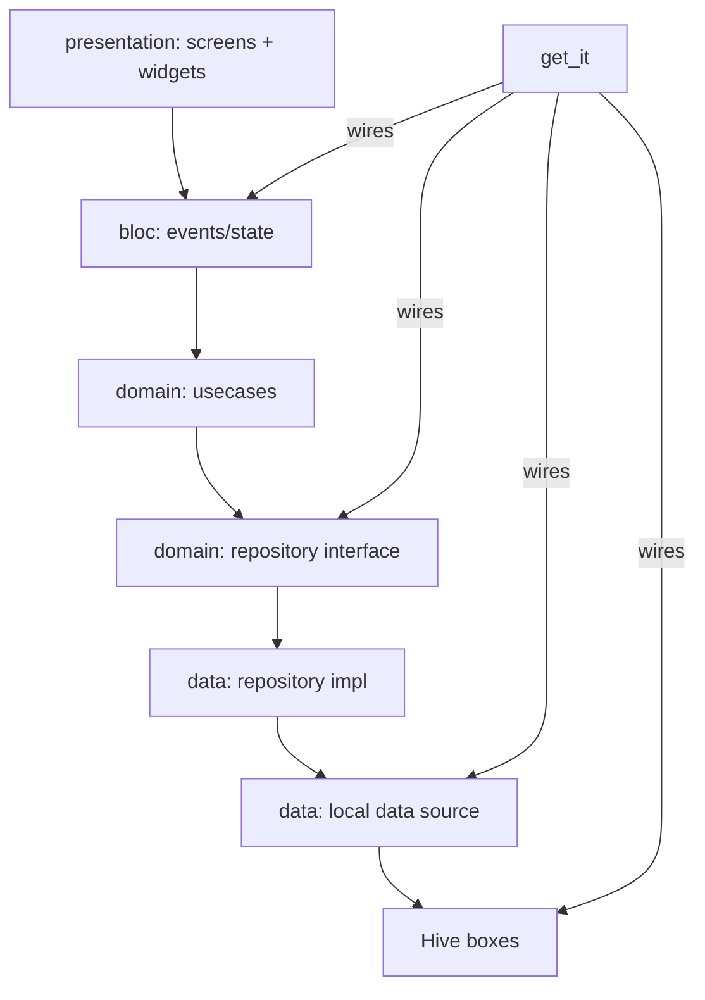

# Architecture (current) — overview

Status: VERIFIED. Commit `2dd2fe4`.

## Current stack
- **Language/SDK:** Dart 3 (sealed classes), Flutter; env `sdk: ^3.11.0`.
- **UI:** Flutter widgets + Material 3 dark theme + ScreenUtil + go_router.
- **State:** flutter_bloc (BLoC pattern) with sealed state classes (Cubit-like event handlers).
- **DI:** get_it (`lib/config/di/injection_container.dart`).
- **Domain/error handling:** dartz `Either<Failure,T>` + typed `Failure` (`core/error/failures.dart`).
- **Persistence:** Hive NoSQL (5 boxes).
- **ID generation:** uuid.
- **Clean-Architecture-inspired layering:** presentation / (bloc) / domain / data.

## Layering & dependency direction

Direction: presentation → domain ← data (domain is the center). UI does not touch Hive except a few pragmatic exceptions (draft save/restore and dashboard next-trip labour-name lookup read boxes directly) — **layering exceptions noted** (see `CURRENT-ARCHITECTURE.md`).

## Boundaries honoured vs violated (VERIFIED)
Honoured:
- Repository abstraction isolates Hive; usecases hold business rules (trip numbering).
- Bloc mediates UI ↔ usecases; sealed states give exhaustive switches.

Violated / pragmatic:
- `dashboard_screen.dart` reads `Hive.box<LabourModel>(labourBox)` directly in the next-trip listener to resolve names (presentation → data).
- `add_edit_work_screen.dart` reads/writes `draft_box` directly (Hive) for draft autosave.
- Analytics/history compute some aggregation inside the screen (presentation logic).
- Duplicate `LabourFormModel` is defined in two screen files (shared-form-model duplication, not a shared layer).

## Strengths & weaknesses
- Strengths: clear separation for domain data rules; typed failures; deterministic testing hooks (mock repo).
- Weaknesses: presentation-layer pragmatism leaks; no use of a formal state container beyond Bloc events; several dead/inert paths; no persistence versioning/migration framework beyond bespoke legacy-key migration; offline single-user.

## Native target architecture
See `08-NATIVE-ANDROID/ANDROID-ARCHITECTURE.md` (Kotlin + Jetpack Compose + M3 + Clean Architecture + Hilt + Coroutines/Flow + UDF/MVI). The current repo is the **behavioural reference**, not the architectural blueprint.
