# FINAL E2E PRODUCT FLOWS + DATA FLOW DIAGRAMS — V1 (Phase 0.75)

End-to-end scenarios for the V1 OWNER. Every step maps to screen + backend op + DB op + audit + (notification where present). Driver/labourer self-service flows are OUT OF V1 (D-1); owner-manages-records covers their data. Offline/sync/conflict/session-expiry/disabled/unauthorized/network-recovery paths are explicit.

## FE1 Owner auth & cold start
Launch → Splash(app-check+session) → Login (cached session → skip) → Provisioned? no→Provision → home. DB users/{uid}; CF provisioning. Audit owner identity. Offline: cached-session allowed; first sign-in needs network. Session-expired → N-08 → re-auth preserving deep link.

## FE2 Owner daily workflow (core, mirrors UC/E2E-1)
Open session (N-24, unique) → Dashboard(N-20) → Trip editor(N-25: vehicle/driver/labour, next-trip copy) → number server-assigned → Trip detail(N-23) attendance toggles → Save (CF) → counts. Correction later (reason+audit). Reports(N-27) reflect. Audit each create/correction. Offline: queue with pending; reconnect reconcile. Conflicts handled.

## FE3 History/search
Browse grouped date→session(N-22→N-23); full-history search(N-27/History). Edit old trip (session open or audited correction). Soft-delete trip cascades attendance, history preserved, undo.

## FE4 Catalogue maintenance
Add/edit/soft-delete labourer/driver/vehicle(N-29/31/30); inactive not assignable; names preserved. Audit edits.

## FE5 Backup/restore/export
Backup(N-38) encrypted+signed local + cloud(optional) → completion notification(S4). Restore: confirm→verify→rollback-on-fail. CSV export(N-27) signed. Audit backup/restore/export. No partial overwrite of newer cloud data without confirmation.

## FE6 Account lifecycle
Profile edit(N-40) self fields. Password reset/change(N-04/39). Delete-my-data(N-39) re-auth+audit→ anonymize business refs. Disabled account(N-06) blocks; local cache cleared. Logout confirm.

## FE7 Network recovery / sync / conflict
Offline writes queued (pending labels). Reconnect auto-sync idempotent. Conflict → owner prompt (keep/reload). Session-expiry mid-queue → re-auth then reconcile; outbox never silently dropped.

## FE8 Unauthorized / forbidden / disabled paths
Not signed in → login (deep-link preserved). Non-owner (shouldn't exist) → Forbidden → owner home. Disabled → N-06. All server-enforced.

## Owner sub-flows (data only, no driver account in V1)
Assignment is owner-set driverId on trip (record); attendance owner-recorded. Driver/labourer self-views deferred (D-1).

## DATA FLOW DIAGRAMS (Mermaid)
1 Authentication
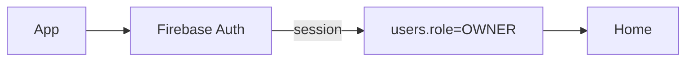
2 Authorization
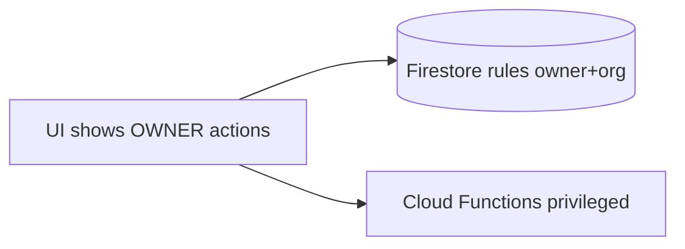
3 Work creation
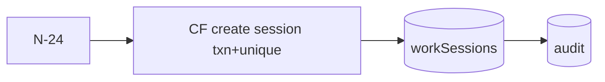
4 Assignment (owner sets driverId record)
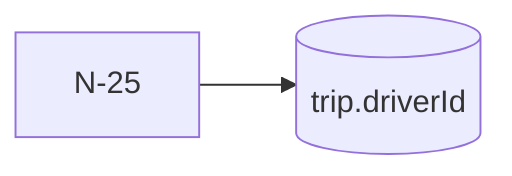
5 Work completion/close
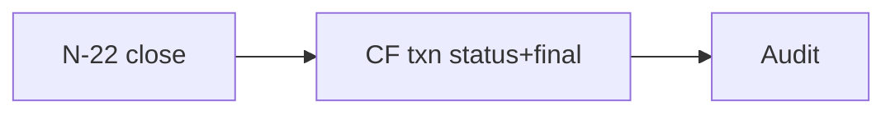
6 Attendance
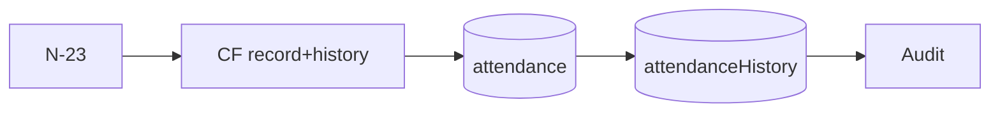
7 Notification (S4 owner-system only)
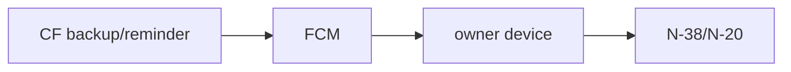
8 Offline mutation
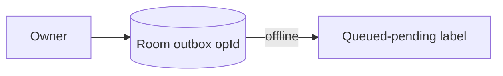
9 Sync
```mermaid
flowchart LR
  Reconnect --> Replay[Replay outbox idempotent] --> CF/FS --> Success|Conflict
```
10 Conflict
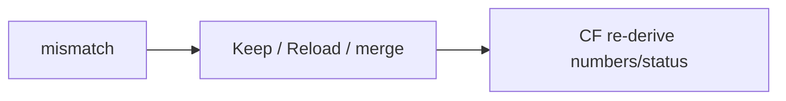
11 Audit event
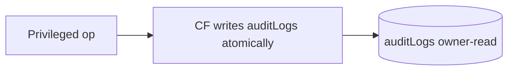
12 Account deletion
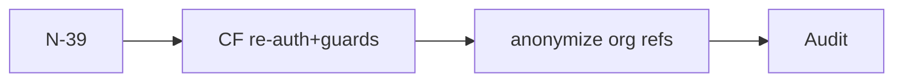
13 Role change
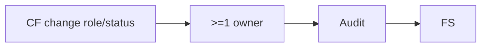
(Admin role change is V2/D-2; diagram kept for continuity, not built in V1.)

## Verification
Each flow is a full integration test (FE1..FE8) with DB+audit+offline assertions (FINAL-TEST-CONTRACT). Driver/labourer personal flows absent until D-1.
