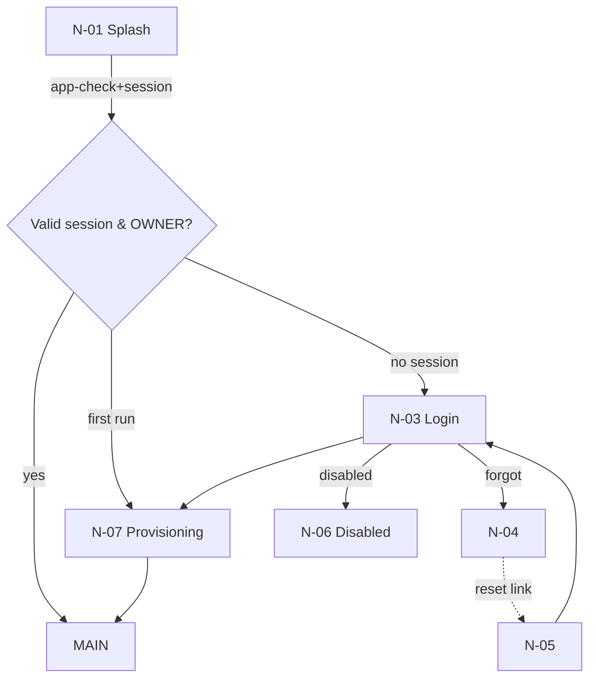
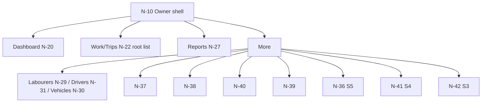

# FINAL NAVIGATION — V1 (Phase 0.75)

Scope S-V1 owner. No orphan route; no dead-end screen. Navigation Compose; auth/main/owner/detail/notification/deep-link/error graphs below. Driver/labourer graphs excluded (D-1).

## 1. Authentication graph

Route args: LOGIN carries `returnTo` (deep link) for post-auth resume. Every entry point after auth is re-validated.

## 2. Main / owner graph

Bottom nav: Dashboard | Work | Reports | More (owner). Re-selecting active tab scrolls to top.

## 3. Detail / editor graph
```mermaid
flowchart TD
  N20[Dashboard N-20] --> N22[Day/Session N-22]
  N22 --> N23[Trip detail N-23]
  N20 --> N24[New/Edit Session N-24]
  N24 --> N25[Trip editor N-25]
  N22 --> N25
  N25 --> N23
  N27[Reports N-27] --> N22 / N28[Export N-28]
  N23 --> N29/N31 (add labour/driver picker)
```
Route args: `sessionId`, `tripId`, `date`/`session`, optional `edit` flag. Origin is preserved for back.

## 4. Notification graph (V1-OPTIONAL, owner)
N-41 → tap → deep link to N-38 (backup), N-22/N-20 (session), N-23 (trip), N-39; each re-validates existence+ownership; if stale → NotFound/Forbidden friendly state + link to current list.

## 5. Error recovery / session expiry graph
Any op → typed Error → Retry (idempotent) stays; Session-expired → N-08 → re-auth → resume (preserve drafts/outbox + deep link). Forbidden → message + navigate to owner home. Disabled → N-06.

## 6. Deep links
Registered app links: session/trip/backup/notification. On cold start: Splash → resolve auth → validate target role/ownership/existence → open or fallback. Never allow a link to bypass auth or expose another org.

## Route register
| Route | Entry | Exit | Args | Auth | Authz | Back | Deep link | Notification |
|---|---|---|---|---|---|---|---|---|
| splash | launch | login/home | — | no | — | exit | — | — |
| login | splash/deep | home | returnTo | unauth | — | exit | yes(returnTo) | — |
| forgot/reset | login/link | login | — | unauth/token | token | back to login | reset link | — |
| disabled | login/redirect | — | — | auth | blocked | exit | — | — |
| provisioning | first run | home | — | auth | CF | exit | — | — |
| home (shell) | login | logout | tab | owner | owner | exit app (root) | yes | yes |
| day/detail | home/others | home | date, session | owner | owner | back to origin | yes | yes |
| trip detail | day/list | parent | tripId | owner | owner | back to origin | yes | yes |
| session editor | home/day | origin | (edit) | owner | owner | pop (draft-safe) | — | — |
| trip editor | session/trip | origin | sessionId,(tripId) | owner | owner | pop (draft-safe) | — | — |
| reports | home | home | period | owner | owner | back | — | — |
| catalogues | more | more | kind | owner | owner | back | — | — |
| backup/restore | more/deep | more | — | owner | owner | back | yes | yes |
| account/profile/settings/audit/notif/help | more | more | — | owner | owner | back | (notif) | (notif) |

## 7. BACK NAVIGATION FINALIZATION (no ambiguity)
Defined per mechanism and context:
- Top-left back: present whenever screen has a parent; performs pop with the same semantics as system back.
- System back (Android) + predictive back gesture: identical to top-left back. Predictive back shows preview; on confirm pops. Single-root owner shell: system back exits app (or moves task to back stack per Android guidance).
- Back from detail/editor: if saved-once → pop immediately (data kept). If unsaved NEW form → autosave draft (reference behaviour) then pop; user is offered "Resume draft" later. Explicit cancel/close still available. Destructive never bound to plain back.
- Back from a deep link/notification: returns to the source list (origin), not sign-out; if the link's target was removed → friendly NotFound with link to current list.
- Dialog / bottom sheet: Back dismisses the dialog/sheet (safe default; focus on cancel). Keyboard: Back closes keyboard first (IME) then navigates.
- Unsaved-data back: never silently discards a saved-once record; new-unsaved autosaves (or shows discard-confirm where the form is long/destructive). Session-expiry while mid-form: autosave + re-auth (N-08) then restore.
- Logout: explicit confirm → sign out → clear local cache/outbox per consent → Login. Not reachable by back.
- Session expiry: not a back; intercepted → N-08.
Rule: **No screen has an undefined Back.** Every route above lists its back behaviour; mismatches are defects.

## 8. Role gate / exit
Non-owner (should not exist in V1) → Forbidden → home. Owner home is terminal root.

## 9. Verification
FT-NAV covers every route: entry/exit/back/args/authz/deep-link/notification/session-expiry; no orphan/dead-end. Driver/labourer graphs deferred (D-1).
