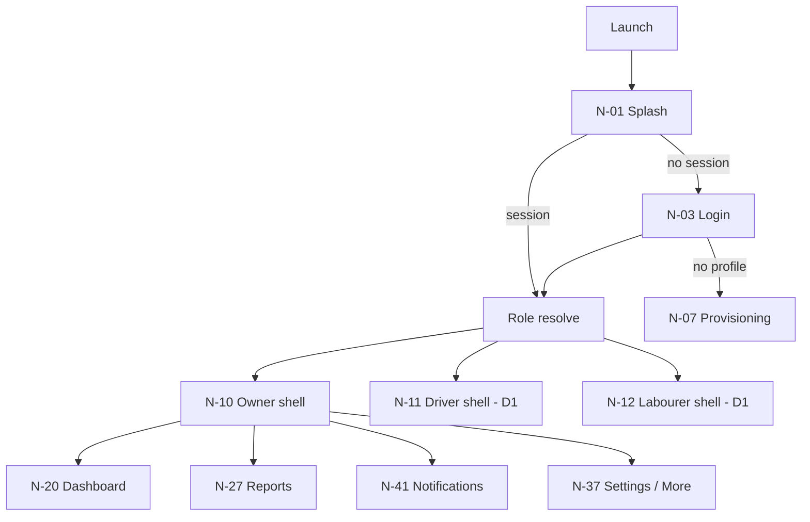

# Navigation Completeness

Status: Phase 0.5 (PROPOSED). Every navigation path, back behaviour, and role graph. Native uses Navigation Compose; role graphs gated by D-1/D-6.

## 1. Global navigation graph


## 2. Owner destinations & children
```mermaid
flowchart LR
  N20[Owner Dashboard]
  N20 --> N24[New/Edit Work]
  N20 --> N23[Trip detail]
  N23 --> N25[New Trip]
  N22[Day detail] --> N23
  N29..32[Crew mgmt] --> N40[Profile]
  N33[Users/Roles] --> N34[User detail]
  N27[Reports] --> N28[Report detail]
  N41[Notifications] --> N23/N50 (deep link)
  N36[Audit log] ; N35[Announcements] ; N38[Backup] ; N39[Account]
```

## 3. Back behaviour matrix (per N-screen class)
| Class | System back | Top-bar back | After deep link | With unsaved data | After auth change |
|---|---|---|---|---|---|
| Auth screens (N-01..08) | exit / to login | none | resolve | n/a | n/a |
| Shell root (N-20..) | exit app (or move task per guidance) | none | landing tab | n/a | to Login if session lost |
| Detail/editor (N-23/24/25/28/40) | pop to origin | pop | pop through to origin list | autosave draft OR confirm discard | session-expiry → re-auth, preserve draft |
| Nested list (N-27,N-29..) | pop to parent tab | pop | as normal | n/a | — |
| Modal/dialog/bottom-sheet | dismiss | close | dismiss | discard-in-progress confirm where relevant | — |

- Back never silently loses an unsaved **saved-once** record; for new unsaved drafts, either autosave (reference behaviour) or explicit discard confirm (decision for each form — default autosave to match reference).
- Back after notification deep link returns to the source list (origin), not logout.

## 4. Bottom navigation audit (owner 4 destinations)
| Dest | Icon | Badge | Stack | Deep-link | State preservation |
|---|---|---|---|---|---|
| Dashboard | dashboard | — | N-20 root | direct | ViewModel SavedState |
| Work/Trips | work | — | date picker→list→detail | to a trip (re-auth) | SavedState |
| Reports | analytics | — | N-27 root | — | SavedState |
| More (Crew/Settings/…/Notifications badge) | menu | notif badge | sub-stack | settings/nofit | SavedState |

Re-selecting an active tab → scroll to top (behaviour). Role changes bottom set (owner vs driver vs labourer) — D-1.

## 5. Large-screen adaptation
Use Material3 adaptive: phone = NavigationBar; medium+ = NavigationRail; two-pane for (a) Work list→editor, (b) Reports, (c) Crew. Never stretch phone nav onto tablets (ADR-013). Applies to all role graphs.

## 6. Logout & session-expiry navigation
Logout: confirm → sign out (cleanup local caches/outbox per security) → Login. Session expired: intercept → re-auth screen with message; outbox preserved & reconciled after auth. Account disabled: N-06 screen. Deep link on expired session → after re-auth resolve the link target.

## 7. Unreachable/dead path flags
- No route for "forbidden resource" — define a Forbidden screen/state reachable from any denied navigation/action (reuse generic state; not a false "success").
- No route duplication; reference `/details` orphan not carried.
- Notification/manual deep links to driver/labourer screens only valid if D-1.

## 8. Verification
Graph PROPOSED; complete for Owner; driver/labourer sub-graphs gated D-1/D-6. Back/exit matrix must be validated in Navigation tests.
