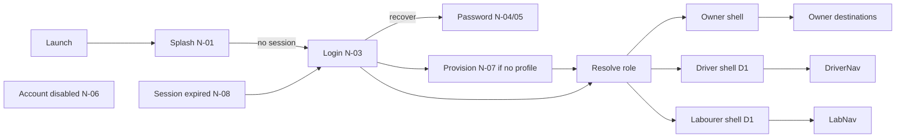
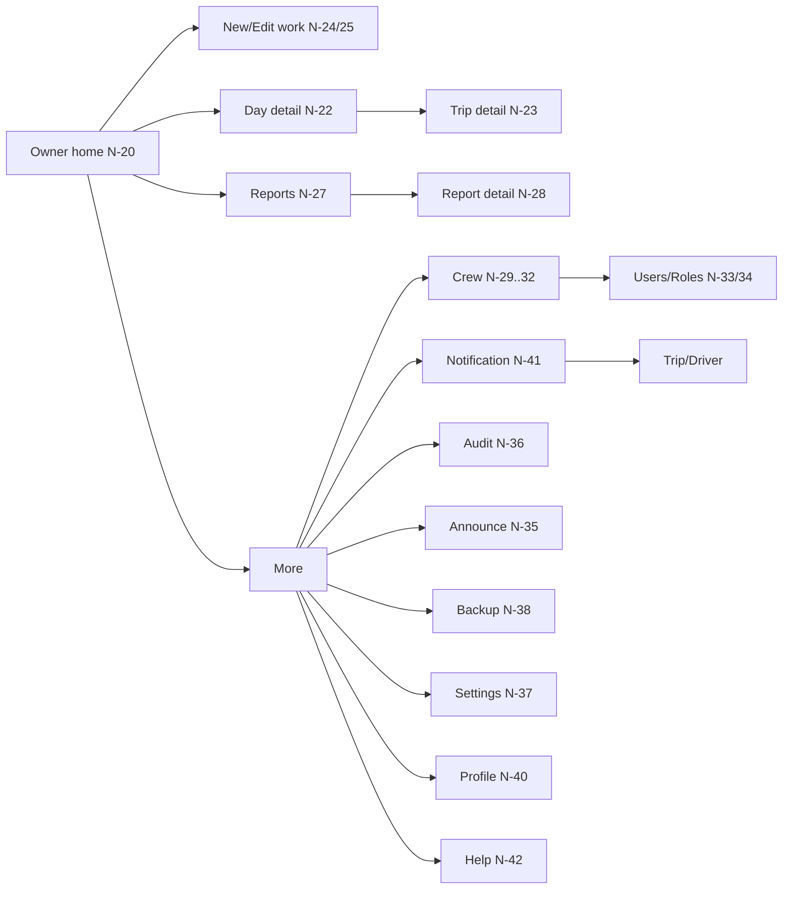
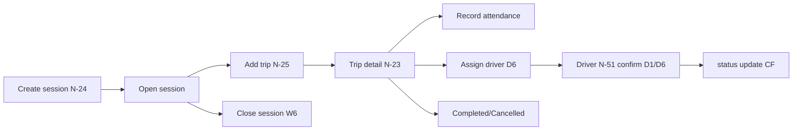
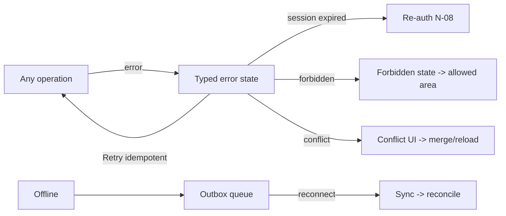
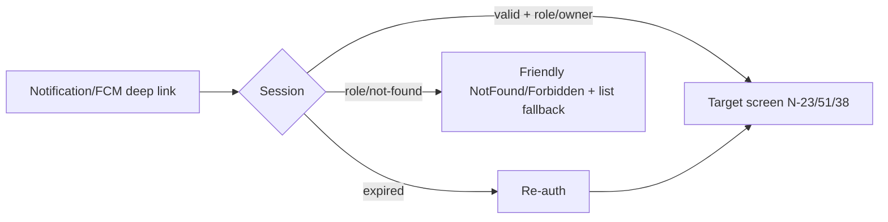
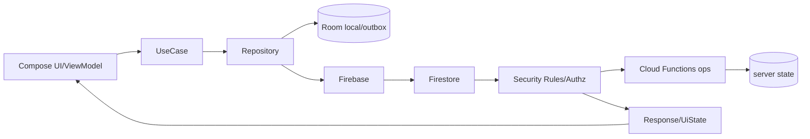
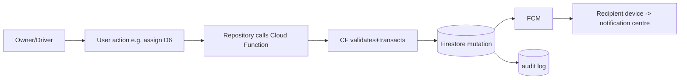
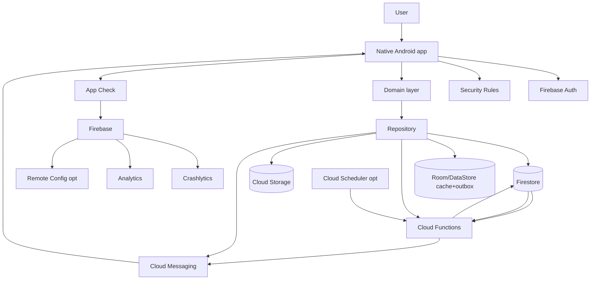

# System Flows

Status: Phase 0.5 (PROPOSED). Mermaid diagrams for architecture/data/state and user-action plumbing. Role-gated branches marked (D-1/D-6).

## 1. Global / auth navigation

## 2. Owner navigation

## 3. Work lifecycle navigation

## 4. Error-recovery navigation

## 5. Deep-link navigation

## 6. UI→data architecture flow

Reads: UI → Repo → Firestore cache(offline) live; writes: UI → UseCase → Repo → Room outbox(offline) or direct; server ops via CF idempotent.

## 7. User action → CF → Firestore → FCM → Recipient

## 8. Master system diagram

## Notes
- Every flow node must map to a screen + backend/data op (else gap flagged). Driver/labourer node groups gated D-1/D-6.
- The data-architecture flow and user-action flow must match the repo/VMM/UseCase layering in ANDROID-ARCHITECTURE.
